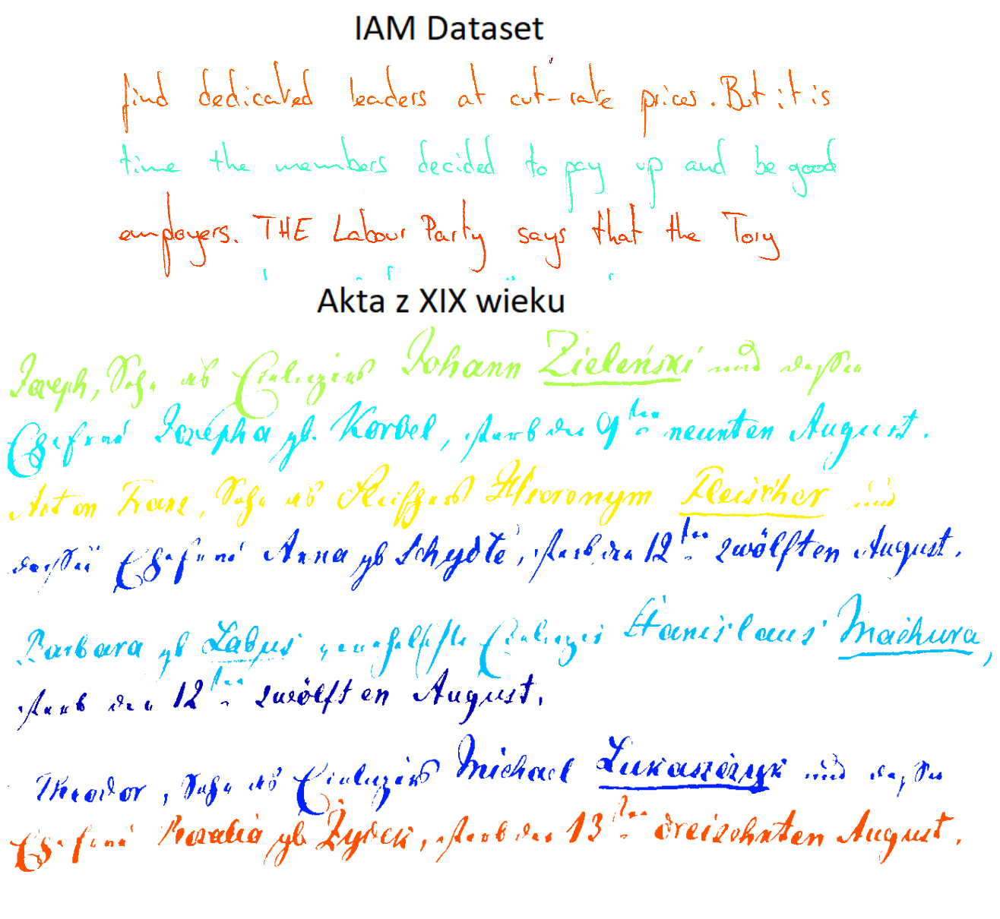
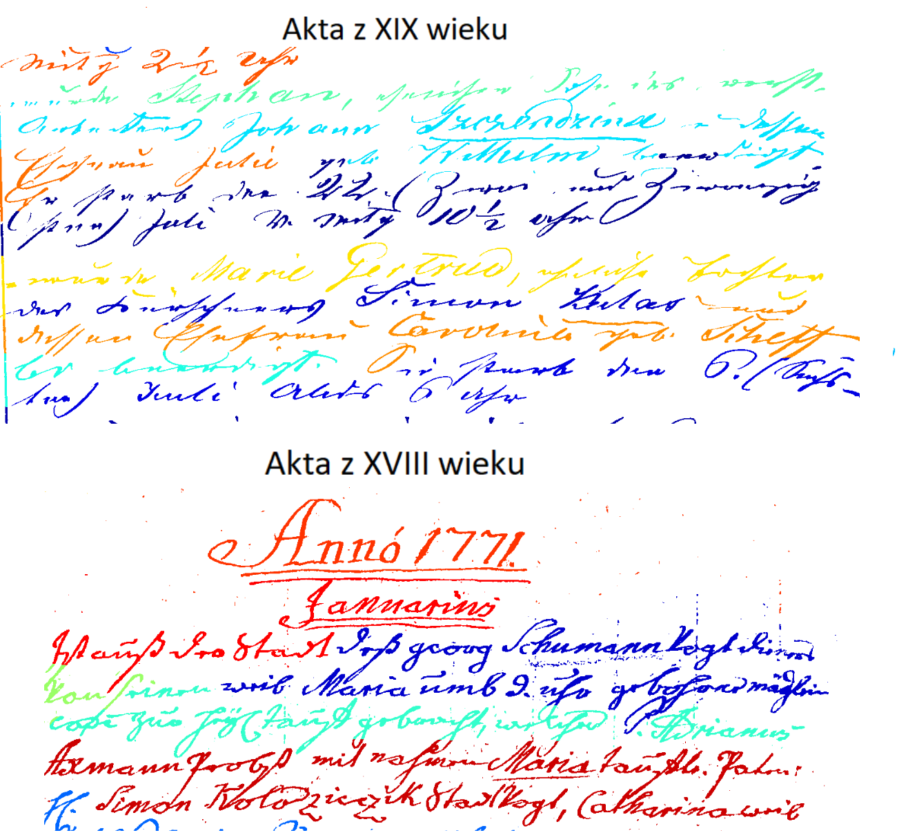
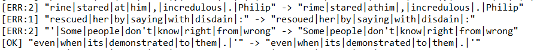
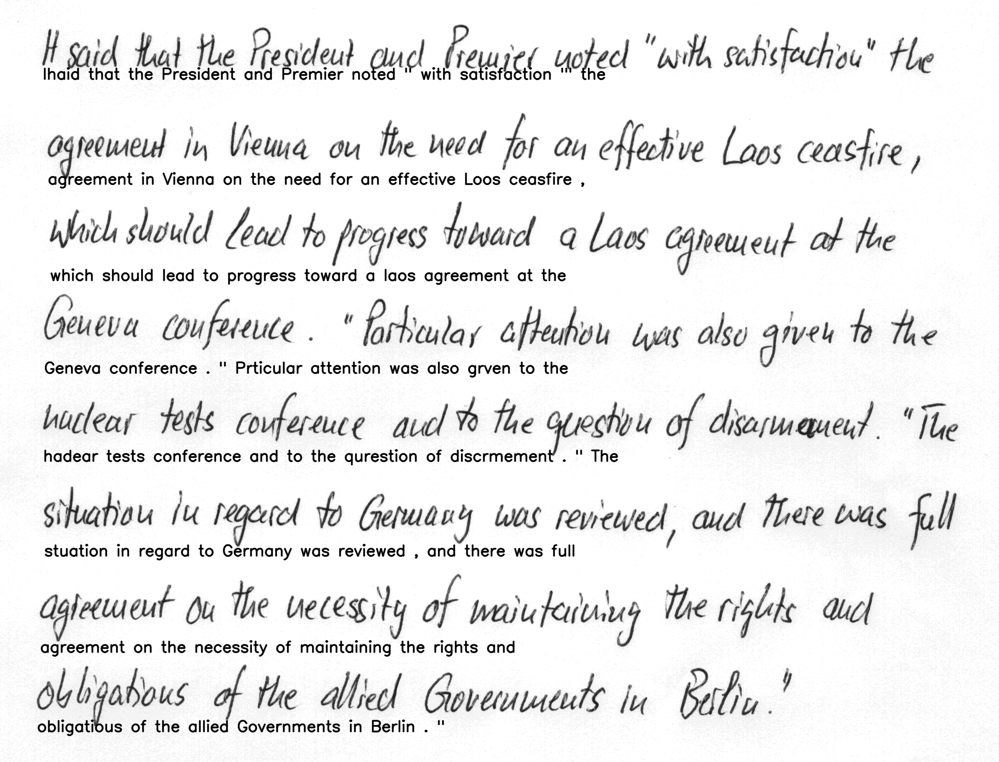

# Master Thesis 
Title: Master thesis - Handwriting recognition for document archiving automation
University: AGH/UST Cracow, Poland
Author: Adam Mika

Description:

This repo contains code for my master thesis project. Also, it contains the paper itself (in polish).

The main goal of the project was preparing an algorithm to segment and read handwritten documents. 
The segmentation was approached in two ways:
 * using Scale Space Anisotropic Gauss filters from here: https://www.mdpi.com/2076-3417/10/22/8276
 * using Siamese Neural networks from here: https://www.cs.bgu.ac.il/~berat/papers/icfhr2020_unsupervised_deep_learning_for_page_segmentation.pdf

The Text recognition was also approached in two ways:
There were two CNN + RNN + CTC architectures implemented:
* SimpleHTR based on: https://github.com/githubharald/SimpleHTR/
* Gated CNN, based on: http://www.tbluche.com/files/icdar17_gnn.pdf

# Siamese Networks

The Siamese Neural networks can be found in the **SiameseNetworks** folder. The idea is the same as in the paper. Main difference is in the data. We use IAM Dataset for the whole project. This part is using the whole pages version of IAM Dataset, which can be downloaded here: https://fki.tic.heia-fr.ch/databases/iam-handwriting-database
All the pictures needs to be pasted to this folder: **PracaMagisterka/SiameseNetworks/data/IAM**. The repo contains of sample files.

Then, please run the preprocessing/cut_images.py script to crop the pictures only to lines of handwritten text. It will be automatically stored appropriately. After that, run the split_dataset.py script from the same directory. After that you can start the model training with **PracaMagisterka/SiameseNetworks/main.py**. Please see Arguments.py for parameters.

The results with IAM dataset were not satisfactory. The netowrk did not learn and this approach was dropped. Perhaps with use of different dataset the result would have been different.

# Scale Space with anizotropic Gauss filters

The second idea of line segmentation was concentrated on conventional methods. The program, written in Matlab, segment the images without learning. The Matlab program on computer is mandatory to run this program. Pls see the Scale-Space directory for details.

# CNN + RNN + CTC architecture for reading handwritten text

To run the SimpleHTR (basic) version, please put the **IAM lines** and groundtruth files into **CNN_RNN_CTC/data** directory. The structure can of the data file can be found here: https://github.com/githubharald/SimpleHTR/, lines can be downloaded here: https://fki.tic.heia-fr.ch/databases/iam-handwriting-database
The Gated version was tested on google colab, with dataset provided from my private kaggle account (the same IAM Lines as for SimpleHTR), please see **Gated_Trials.ipynb**.

# Results and testing

In the paper the final outcome consist of a pipeline with Scale-Space segmentation module and Handwritten text recognition module connected together.
The connection is made with **main.py** file in the main directory. To run this there needs to be a model prepared for CNN_RNN_CTC architecture. 

The Scale-Space program has 100% accuracy in segmenetation of IAM Database images. It was also used for historical documents from XIX and XVIII century, where it's results were pooper, respecivelty around 60 and 30 %. 
The SimpleHTR read lines delievered from Scale-Space program with accuracy around 85%, calucalted with Character Error Rate method (Levenshtein distance).

Below there are output pictures attached:

Good Segmentation:

Bad Segmentation:

Text recognition example:

both line segmentation and text recognition (found text put under every line):

If You found it interesting and have any additional questions, please contact directly: adam.k.mika@gmail.com

References:
Rafi Cohen, Itshak Dinstein, Jihad El-Sana, Klara Kedem. "Using Scale-Space Anisotropic Smoothing for Text Line Extraction in Historical Documents", ICIAR 2014
